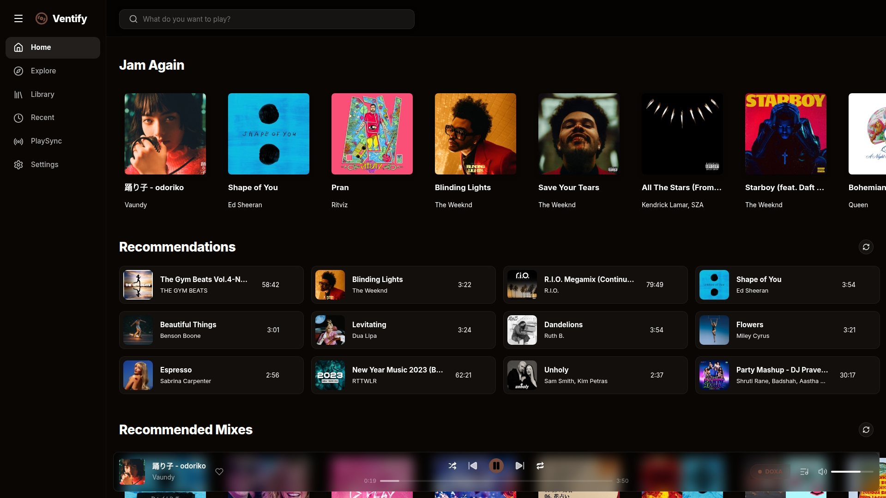
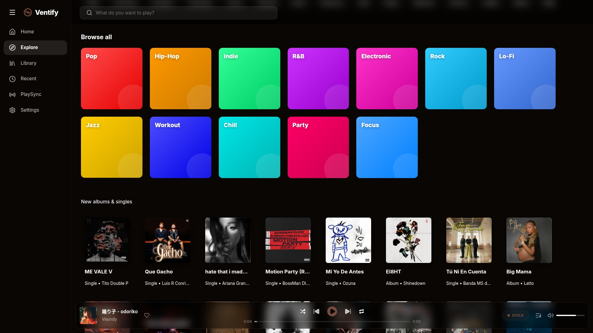
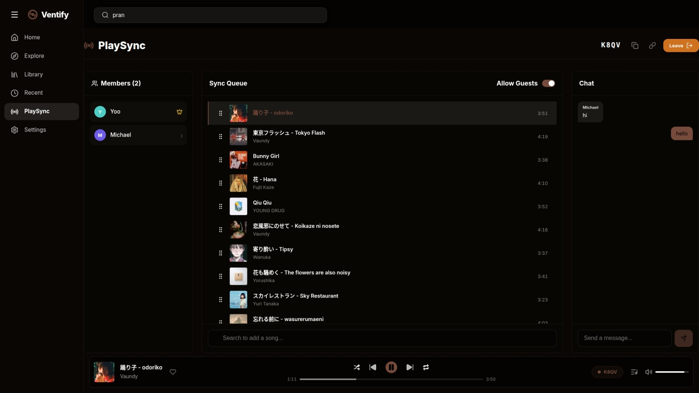
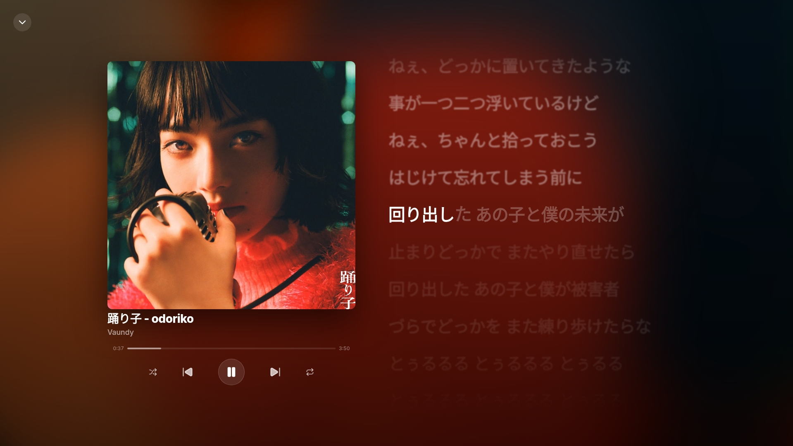

# About

a music streaming client.
## Features

### Audio & Playback
- Ad-free streaming directly from the YouTube Music.
- Full-screen player with dynamic, blurred album art background
- Real-time, word-by-word synced lyrics

### Interface
- Responsive UI built with styled-components
- Clean, native-feeling design
- Fast navigation with minimal loading states

### Discovery & Organization
- Explore hub with natively curated genre and mood carousels (Pop, Chill, Workout, etc.)
- Save your favorite songs and manage custom playlists
- Quick access to recently played tracks and recommended mixes

### Social & Integrations
- PlaySync: Host or join listening sessions with friends
- Real-time synchronized playback and queue management
- Built-in live chat during PlaySync sessions

## Screenshots






## Getting Started

First, clone the repository and install the dependencies:

```bash
git clone https://github.com/yourusername/ventify.git
cd ventify
npm install
```

Then, start the development server:

```bash
npm run dev
```

Open [http://localhost:3000](http://localhost:3000) in your browser to start listening.
